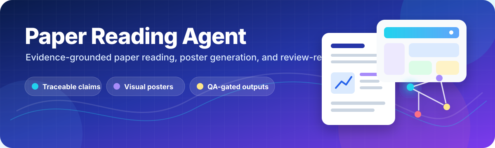
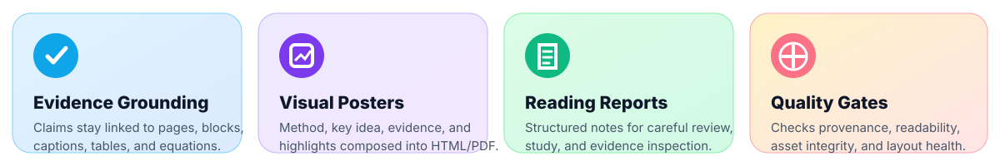
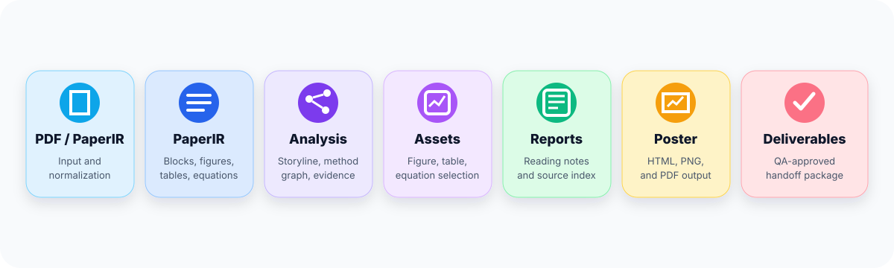
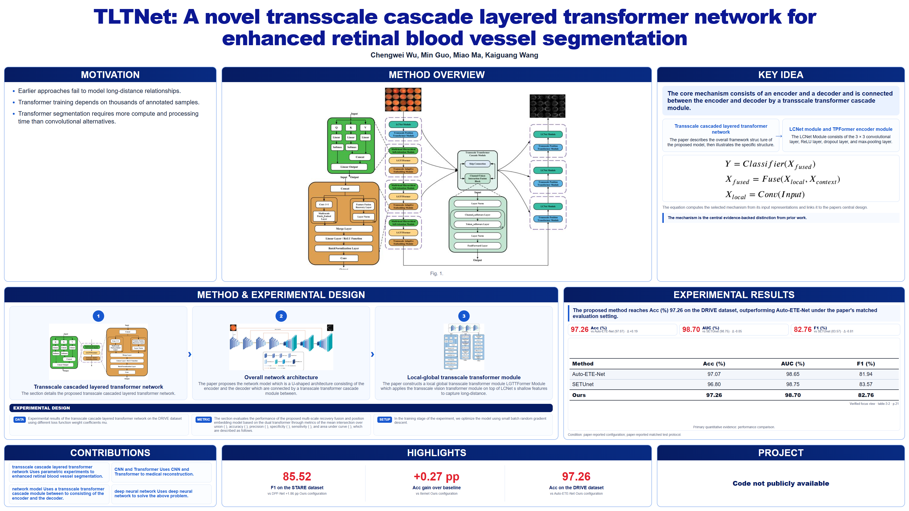
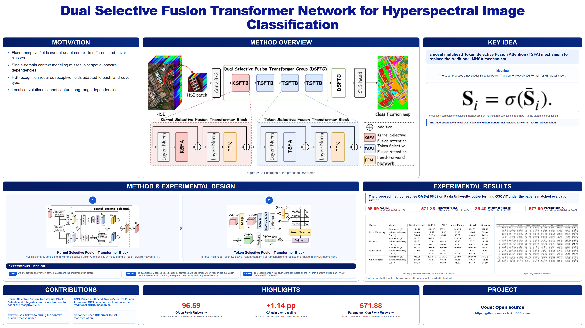
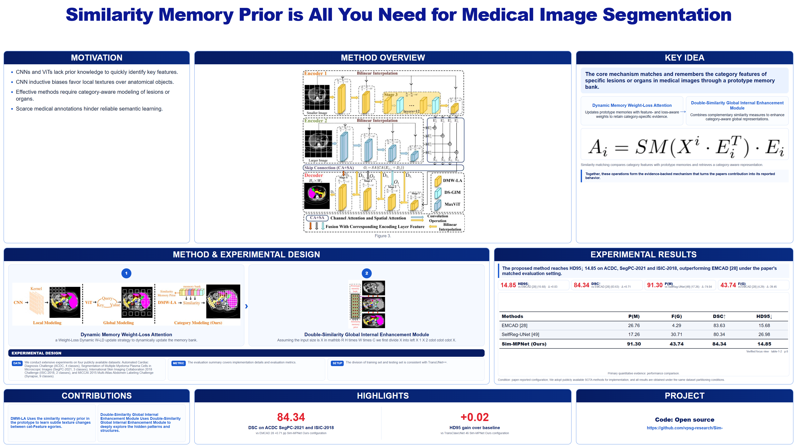
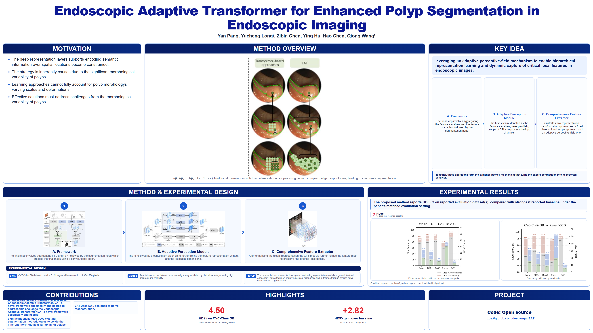
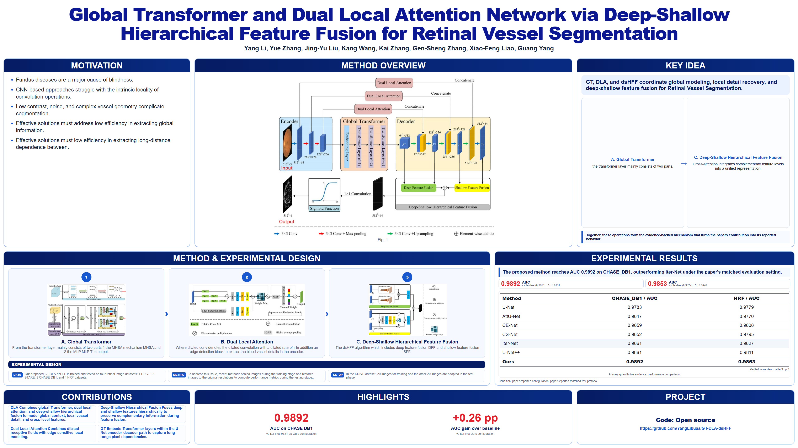

<p align="center">
  
</p>

<p align="center">
  <a href="#quick-start"></a>
  <a href="#gallery"></a>
  <a href="#quality-gates"></a>
</p>

<p align="center">
  
  
  
  
  
</p>

<h1 align="center">Paper Reading Agent</h1>

<p align="center">
  <strong>Turn dense research papers into evidence-grounded reading notes, visual posters, and review-ready deliverable folders.</strong>
</p>

<p align="center">
  Paper Reading Agent is a local academic-PDF pipeline with strict source traceability. It normalizes a paper into structured artifacts, builds a claim-to-evidence graph, selects useful figures, tables, and equations, and produces two reader-facing outputs: a detailed reading report and a presentation-ready poster.
</p>

<p align="center">
  <a href="#why-paper-reading-agent">Why this project</a> |
  <a href="#workflow">Workflow</a> |
  <a href="#gallery">Gallery</a> |
  <a href="#quick-start">Quick Start</a> |
  <a href="#main-artifacts">Artifacts</a> |
  <a href="#development">Development</a>
</p>

<p align="center">
  
</p>

## Why Paper Reading Agent?

Most paper tools stop at summarization. Paper Reading Agent is designed for
inspectable understanding: major visible statements remain tied to source
sections, pages, blocks, captions, tables, equations, or extracted visual
assets.

<table>
<tr>
<td width="33%" valign="top">

### Read With Evidence

Recover the paper's storyline, claims, method structure, results, and
provenance without losing the link back to the original document.

</td>
<td width="33%" valign="top">

### Reconstruct The Paper

Build normalized `PaperIR`, a method graph, a claim-evidence ledger, and
selected visual assets that can be inspected and tested.

</td>
<td width="33%" valign="top">

### Present The Result

Generate an AMP-style poster and a detailed reading report, then package the
clean outputs into a review-ready folder.

</td>
</tr>
</table>

<p align="center">
  
</p>

## Feature Highlights

<table>
<tr>
<td width="50%" valign="top">

### Evidence-Grounded Analysis

Storyline, claims, evidence blocks, method nodes, selected assets, and source
provenance are persisted as machine-readable JSON.

</td>
<td width="50%" valign="top">

### Structured Poster Generation

Builds a poster with dedicated Motivation, Method Overview, Key Idea,
Experimental Results, Contributions, and Highlights panels.

</td>
</tr>
<tr>
<td width="50%" valign="top">

### Reading-Report Generation

Creates navigable reading notes in HTML and Markdown, with optional PDF export
and a source index for careful inspection.

</td>
<td width="50%" valign="top">

### Staged Quality Gates

Checks source bindings, missing assets, visible text, result readability,
layout overflow, and browser-export integrity before delivery.

</td>
</tr>
<tr>
<td width="50%" valign="top">

### Final Deliverable Packaging

Copies clean reader-facing outputs into `00-final-deliverables/` while
preserving the full debug run for regression and auditing.

</td>
<td width="50%" valign="top">

### Complex PDF Ingestion

Uses MinerU's official cloud client to process complex academic PDFs while
retaining extracted blocks, figures, tables, and equations.

</td>
</tr>
</table>

<p align="center">
  
</p>

<a id="workflow"></a>

## Workflow

<p align="center">
  
</p>

The pipeline does not assume that `Figure 1` is the overview figure or that the
largest table is the main result. It reads captions and surrounding context,
classifies visual roles, binds claims to evidence, and validates selected
assets before delivery.

```text
PDF or PaperIR
    |
    |-- Ingestion and PaperIR normalization
    |-- Storyline, method graph, and claim-evidence audit
    |-- Asset catalog and visual selection
    |-- Reading report: HTML / Markdown / optional PDF
    |-- Poster: HTML / optional PNG / optional PDF
    `-- QA-approved 00-final-deliverables/
```

<a id="gallery"></a>

## Gallery

Real posters generated by the pipeline. Click any image to open the full-size
version. Gallery paths are preserved under `docs/gallery/`.

<table>
<tr>
<td width="50%" align="center">
<a href="docs/gallery/02-s0010482524008588.png">

</a>
<br><sub><strong>Poster Example 02</strong></sub>
</td>
<td width="50%" align="center">
<a href="docs/gallery/08-2410-03171v3.png">

</a>
<br><sub><strong>Poster Example 08</strong></sub>
</td>
</tr>
<tr>
<td width="50%" align="center">
<a href="docs/gallery/14-2507-00585v3.png">

</a>
<br><sub><strong>Poster Example 14</strong></sub>
</td>
<td width="50%" align="center">
<a href="docs/gallery/21-endoscopic-adaptive-transformer-polyp.png">

</a>
<br><sub><strong>Adaptive Transformer Poster</strong></sub>
</td>
</tr>
<tr>
<td width="50%" align="center">
<a href="docs/gallery/23-global-transformer-dual-local-retinal.png">

</a>
<br><sub><strong>Global-Local Retinal Poster</strong></sub>
</td>
<td width="50%" align="center" valign="middle">

### Explore The Gallery

Browse more generated posters, layouts, and visual experiments in
[`docs/gallery`](docs/gallery).

</td>
</tr>
</table>

<p align="center">
  
</p>

## Output At A Glance

Each poster-mode run keeps the full intermediate pipeline and creates a compact
handoff package:

```text
00-final-deliverables/
|-- README.md
|-- manifest.json
|-- notes/
|   `-- reading-notes.md
|-- poster/
|   |-- poster.html
|   |-- poster.png
|   `-- poster.pdf
|-- reading-report/
|   |-- reading_report.html
|   |-- reading_report.md
|   `-- reading_report.pdf
`-- qa/
    |-- final_qa_report.json
    |-- reading_report_qa.json
    `-- pipeline_summary.json
```

The full run directory remains available for debugging, regression testing, and
machine-readable inspection. `00-final-deliverables/` is the clean folder
intended for readers, reviewers, or teachers.

## Requirements

<table>
<tr>
<td width="50%" valign="top">

### Required

- Python 3.10+
- Node.js and npm
- A MinerU account and API token
- `mineru-open-api`, MinerU's official cloud extraction client

</td>
<td width="50%" valign="top">

### Optional Browser Export

- Microsoft Edge or Google Chrome
- Playwright available through a Node.js `node_modules` directory

Without browser export support, the pipeline still produces HTML, Markdown,
JSON reports, and QA metadata.

</td>
</tr>
</table>

## Installation

### 1. Install The Python Package

```powershell
cd paper-reading-agent
python -m pip install -e .
```

For development and validation:

```powershell
python -m pip install -e ".[dev,validation]"
```

### 2. Install MinerU's Official Client

```powershell
npm install --prefix .tools mineru-open-api
```

### 3. Optional: Install Playwright For PNG/PDF Export

```powershell
npm install --prefix .tools playwright
$env:PAPER_READER_NODE_MODULES = (Resolve-Path .tools\node_modules)
```

### 4. Authenticate MinerU

```powershell
.\.tools\node_modules\.bin\mineru-open-api.cmd auth
.\.tools\node_modules\.bin\mineru-open-api.cmd auth --verify
```

<a id="quick-start"></a>

## Quick Start

### Analysis-Only Pipeline

```powershell
$env:PAPERPOSTER_MINERU_MODEL = "vlm"
$env:PAPERPOSTER_MINERU_LANGUAGE = "en"

paper-reader `
  --input paper.pdf `
  --output runs/paper-analysis `
  --mode analysis
```

### Full Poster And Reading-Report Pipeline

```powershell
paper-reader `
  --input paper.pdf `
  --output runs/paper-poster `
  --mode poster
```

### Skip Browser Export

Use this mode when you only need HTML, Markdown, JSON, and QA artifacts:

```powershell
paper-reader `
  --input paper.pdf `
  --output runs/paper-poster `
  --mode poster `
  --no-browser-export
```

### Rebuild Final Deliverables For An Existing Run

```powershell
paper-deliverables `
  --summary runs/paper-poster/pipeline_summary.json
```

<p align="center">
  
</p>

<a id="main-artifacts"></a>

## Main Artifacts

<table>
<tr>
<td width="50%" valign="top">

### Analysis Mode

- `paper_ir.json`: normalized blocks, figures, tables, equations, and
  provenance
- `paper_story.json`: sourced reading storyline
- `claim_evidence.json`: claim-to-block evidence bindings
- `method_graph.json`: recovered method structure
- stage reports under `05-reports/`

</td>
<td width="50%" valign="top">

### Poster Mode

- `poster.html`, `poster.png`, `poster.pdf`
- `poster_spec.json`
- `reading_report.html`, `reading_report.md`, `reading_report.pdf`
- `reading_report_spec.json` and `source_index.json`
- `final_qa_report.json`
- `00-final-deliverables/`

</td>
</tr>
</table>

<a id="quality-gates"></a>

## Quality Gates

The QA layer is intentionally evidence-focused. It blocks issues that could
make an output misleading or unusable, including:

- invalid claim or evidence identifiers;
- missing or broken source assets;
- unsupported parser fallback paths;
- severe text overflow or layout overlap;
- unreadable primary result evidence;
- broken browser exports;
- visible source artifacts or incomplete handoff files.

Presentation sparsity is treated more gently. A paper can remain usable with
warnings when, for example, it has fewer displayable items, a result table
needs a better focus crop, or a selected asset lacks only a caption while page
and bounding-box provenance remain intact.

## README Visual Assets

The README visual resources live in `docs/readme/`:

- [hero-banner.svg](docs/readme/hero-banner.svg)
- [feature-strip.svg](docs/readme/feature-strip.svg)
- [workflow-diagram.svg](docs/readme/workflow-diagram.svg)
- [section-divider.svg](docs/readme/section-divider.svg)
- [footer-strip.svg](docs/readme/footer-strip.svg)

The original GitHub README text is preserved in
[README.original.md](README.original.md).

## Privacy Notice

> [!WARNING]
> PDF ingestion uses MinerU's official cloud extraction client. When you run the PDF path, the source document is transmitted to `mineru.net`.

Do not use the cloud ingestion route for confidential, unpublished, or
restricted papers unless you have permission to upload them. Existing `PaperIR`
JSON files can be processed without calling MinerU.

## Repository Layout

```text
paper-reading-agent/
|-- src/paperposter/       # Python pipeline implementation
|-- skills/                # Codex skill wrappers and stage instructions
|-- schemas/               # JSON schemas for generated artifacts
|-- examples/              # Small local PaperIR example and assets
|-- docs/
|   |-- gallery/           # Poster examples
|   `-- readme/            # README visual assets
|-- tests/                 # Regression and contract tests
|-- tools/                 # Helper scripts
`-- pyproject.toml
```

<a id="development"></a>

## Development

Run the complete test suite:

```powershell
python -m pytest tests -q
```

Run a single pipeline test:

```powershell
python -m pytest tests/test_pipeline.py -q
```

## Project Status

This project currently includes:

- MinerU cloud-client ingestion;
- local PaperIR contracts;
- evidence-grounded analysis stages;
- poster generation and browser export;
- reading-report generation;
- final deliverable export;
- staged QA and regression tests.

No MinerU model runtime or paper dataset is bundled with this repository.

## License

MIT License. See [LICENSE](LICENSE).

<p align="center">
  
</p>
